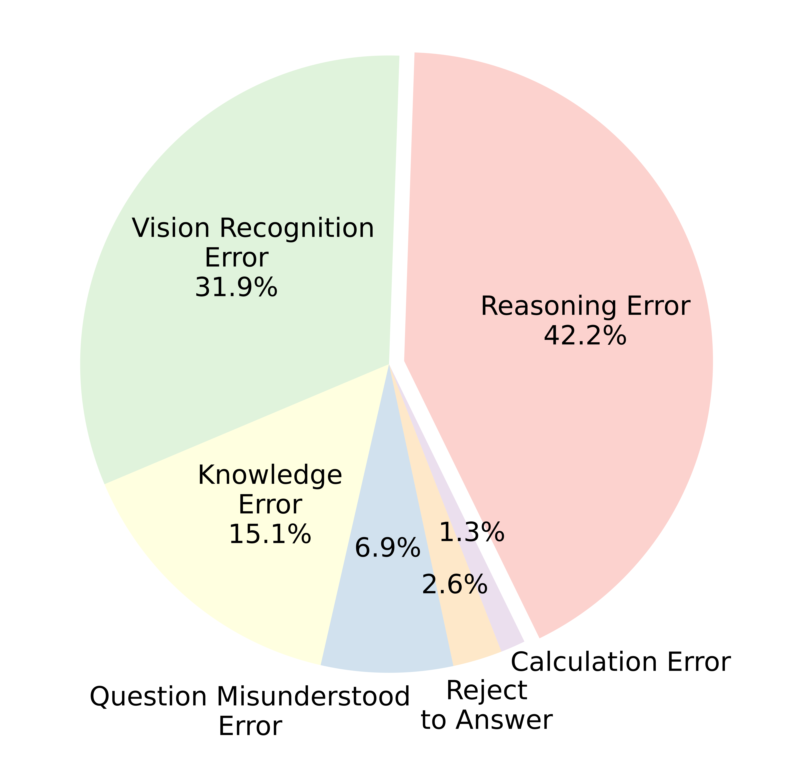

# Measuring Multimodal Mathematical Reasoning with the MATH-Vision🔥 Dataset

 
 
 

 
 


🌟  This is the official repository for the paper "[Measuring Multimodal Mathematical Reasoning with MATH-Vision Dataset](https://arxiv.org/pdf/2402.14804.pdf)", which contains both evaluation code and data for the **MATH-V** benchmark.

[[🌐 Homepage](https://mathvision-cuhk.github.io/)] [[📖 ArXiv Paper](https://arxiv.org/pdf/2402.14804.pdf)] [[🤗 Huggingface Dataset](https://huggingface.co/datasets/mathvision/mathvision)] [[🔍 Visualization](https://mathvision-cuhk.github.io/#visualization)]

## 💥 News

- **[2024-02-22]** Our paper is now accessible at [ArXiv Paper](https://arxiv.org/abs/2402.14804).

## 👀 Introduction

Recent advancements in Large Multimodal Models (LMMs) have shown promising results in mathematical reasoning within visual contexts, with models approaching human-level performance on existing benchmarks such as MathVista. However, we observe significant limitations in the diversity of questions and breadth of subjects covered by these benchmarks. To address this issue, we present the MATH-Vision (MATH-V) dataset, a meticulously curated collection of 3,040 high-quality mathematical problems with visual contexts sourced from real math competitions. Spanning 16 distinct mathematical disciplines and graded across 5 levels of difficulty, our dataset provides a comprehensive and diverse set of challenges for evaluating the mathematical reasoning abilities of LMMs.

<p align="center">
     <br>
  Levels, subjects and sources distribution of <b>MATH-V</b>.
</p>

Through extensive experimentation, we unveil a notable performance gap between current LMMs and human performance on MATH-V, underscoring the imperative for further advancements in LMMs.

<p align="center">
     <br>
  The accuracies of four prominent Large Multimodal Models (LMMs), random chance, and human
performance are evaluated on our proposed <b>MATH-Vision (MATH-V)</b> across 16 subjects. Human performance is assessed using the testmini subset.
</p>

Moreover, our detailed categorization allows for a thorough error analysis of LMMs, offering valuable insights to guide future research and development.

<p align="center">
     <br>
  Error distribution of 232 GPT-4V wrong results on the testmini subset of <b>MATH-V</b>.
</p>

You can refer to the [project homepage](https://mathvision-cuhk.github.io/) and [the paper](https://arxiv.org/pdf/2402.14804.pdf) for more details.

## 📐 Dataset Examples

Some examples of MATH-V on three subjects: analytic geometry, topology, and graph theory.

<details>
<summary>Analytic geometry</summary><p align="center">
     <br>
</p></details>

<details>
<summary>Topology</summary><p align="center">
     <br>
</p></details>

<details>
<summary>Graph Geometry</summary><p align="center">
     <br>
</p></details>

You can refer to the Appendix D.3 of [the paper](https://arxiv.org/pdf/2402.14804.pdf) for example images of 16 subjects.

## 🏆 Leaderboard

To contribute your results to the leaderboard, please kindly forward your result JSON file to the [provided email address](wangk.gm@gmail.com), adhering to the [specified file format](./outputs/Random-Chance.jsonl). The leaderboard is regularly updated to reflect the latest submissions.

Accuracy scores on the **test** set (3,040 examples):

| **#** | **Model**        | **Method**         | **Date** | **ALL** | **Alg** | **AnaG** | **Ari** | **CombG** | **Comb** | **Cnt** | **DescG** | **GrphT** | **Log** | **Angle** | **Area** | **Len** | **SolG** | **Stat** | **Topo** | **TransG** |
| ----------- | ---------------------- | ------------------------ | -------------- | ------------- | ------------- | -------------- | ------------- | --------------- | -------------- | ------------- | --------------- | --------------- | ------------- | --------------- | -------------- | ------------- | -------------- | -------------- | -------------- | ---------------- |
| 1           | GPT-4V                 | LMM (Text+Image)         | 2024-02-22     | 22.76         | 27.3          | 32.1           | 35.7          | 21.1            | 16.7           | 13.4          | 22.1            | 14.4            | 16.8          | 22.0            | 22.2           | 20.9          | 23.8           | 24.1           | 21.7           | 25.6             |
| 2           | Gemini Pro             | LMM (Text+Image)         | 2024-02-22     | 17.66         | 15.1          | 10.7           | 20.7          | 20.1            | 11.9           | 7.5           | 20.2            | 21.1            | 16.8          | 19.1            | 19.0           | 20.0          | 14.3           | 13.8           | 17.4           | 20.8             |
| 3           | Qwen-VL-Max            | LMM (Text+Image)         | 2024-02-22     | 15.59         | 10.7          | 19.1           | 20.0          | 16.9            | 12.5           | 17.9          | 16.4            | 12.2            | 21.0          | 13.3            | 14.2           | 19.8          | 11.5           | 20.7           | 13.0           | 17.3             |
| 4           | InternLM-XComposer2-VL | LMM (Text+Image)         | 2024-02-22     | 14.54         | 9.3           | 15.5           | 12.1          | 15.3            | 11.3           | 10.5          | 14.4            | 22.2            | 19.3          | 19.7            | 15.6           | 15.0          | 11.9           | 15.5           | 26.1           | 15.5             |
| 5           | SPHINX-MoE             | LMM (Text+Image)         | 2024-02-22     | 14.18         | 7.8           | 17.9           | 14.3          | 15.6            | 9.5            | 11.9          | 12.5            | 15.6            | 12.6          | 16.2            | 15.6           | 17.8          | 13.5           | 12.1           | 8.7            | 16.1             |
| 6           | GPT-4-CoT              | LLM (Text+Image Caption) | 2024-02-22     | 13.10         | 16.5          | 20.2           | 34.3          | 10.4            | 17.9           | 19.4          | 7.7             | 11.1            | 10.1          | 9.8             | 9.6            | 9.1           | 13.5           | 13.8           | 8.7            | 12.5             |
| 7           | ShareGPT4V-13B         | LMM (Text+Image)         | 2024-02-22     | 11.88         | 7.5           | 15.5           | 16.4          | 10.7            | 8.9            | 9.0           | 11.5            | 8.9             | 7.6           | 11.6            | 13.0           | 17.4          | 10.3           | 8.6            | 8.7            | 12.5             |
| 8           | LLaVA-v1.5-13B         | LMM (Text+Image)         | 2024-02-22     | 11.12         | 7.0           | 14.3           | 14.3          | 9.1             | 6.6            | 6.0           | 13.5            | 5.6             | 13.5          | 10.4            | 12.6           | 14.7          | 11.5           | 13.8           | 13.0           | 10.7             |
| 9           | Qwen-VL-Plus           | LMM (Text+Image)         | 2024-02-22     | 10.72         | 11.3          | 17.9           | 14.3          | 12.7            | 4.8            | 10.5          | 15.4            | 8.9             | 14.3          | 11.6            | 6.4            | 10.0          | 14.3           | 6.9            | 8.7            | 11.31            |
| 10          | ShareGPT4V-7B          | LMM (Text+Image)         | 2024-02-22     | 10.53         | 5.5           | 3.6            | 12.9          | 10.1            | 4.8            | 7.5           | 11.5            | 14.4            | 10.9          | 16.2            | 11.8           | 12.3          | 9.8            | 15.5           | 17.4           | 11.3             |
| 11          | ChatGPT-3.5-CoT        | LLM (Text+Image Caption) | 2024-02-22     | 9.74          | 10.7          | 20.0           | 18.6          | 10.1            | 7.7            | 17.9          | 16.4            | 10.0            | 13.5          | 6.4             | 5.8            | 6.5           | 9.4            | 12.1           | 4.4            | 10.7             |
| 12          | SPHINX (V2)            | LMM (Text+Image)         | 2024-02-22     | 9.70          | 6.7           | 7.1            | 12.9          | 7.5             | 7.7            | 6.0           | 9.6             | 16.7            | 10.1          | 11.0            | 11.8           | 12.5          | 8.2            | 8.6            | 8.7            | 6.0              |
| 13          | LLaVA-v1.5-7B          | LMM (Text+Image)         | 2024-02-22     | 8.52          | 7.0           | 7.1            | 10.7          | 7.1             | 4.8            | 10.5          | 7.7             | 10.0            | 9.2           | 15.6            | 10.2           | 9.8           | 5.3            | 8.6            | 4.4            | 4.8              |
| 14          | GPT-4-CoT              | LLM (Text)               | 2024-02-22     | 8.16          | 12.8          | 10.7           | 15.7          | 4.9             | 10.7           | 10.5          | 1.9             | 5.6             | 8.4           | 8.1             | 6.2            | 8.7           | 8.6            | 3.5            | 4.4            | 4.8              |
| 15          | Random Chance          | -                        | 2024-02-22     | 7.17          | 1.5           | 11.9           | 7.1           | 9.7             | 4.8            | 6.0           | 22.1            | 1.1             | 7.6           | 0.6             | 9.4            | 6.7           | 8.2            | 8.6            | 13.0           | 7.1              |

Accuracy scores on the **testmini** subset (304 examples):

| **#** | **Model**        | **Method**         | **Date** | **ALL** | **Alg** | **AnaG** | **Ari** | **CombG** | **Comb** | **Cnt** | **DescG** | **GrphT** | **Log** | **Angle** | **Area** | **Len** | **SolG** | **Stat** | **Topo** | **TransG** |
| ----------- | ---------------------- | ------------------------ | -------------- | ------------- | ------------- | -------------- | ------------- | --------------- | -------------- | ------------- | --------------- | --------------- | ------------- | --------------- | -------------- | ------------- | -------------- | -------------- | -------------- | ---------------- |
| -           | Human                  | -                        | 2024-02-22     | 75.66         | 57.9          | 79.0           | 100.0         | 100.0           | 47.4           | 94.7          | 89.5            | 63.2            | 63.2          | 36.8            | 52.6           | 73.7          | 89.5           | 89.5           | 100.0          | 73.7             |
| 1           | GPT-4V                 | LMM (Text+Image)         | 2024-02-22     | 22.37         | 26.3          | 31.6           | 36.8          | 21.1            | 15.8           | 10.5          | 21.1            | 15.8            | 15.8          | 21.1            | 21.1           | 21.1          | 26.3           | 26.3           | 21.1           | 26.3             |
| 2           | Gemini Pro             | LMM (Text+Image)         | 2024-02-22     | 17.11         | 15.8          | 10.5           | 21.1          | 21.1            | 10.5           | 5.3           | 21.1            | 21.1            | 15.8          | 21.1            | 21.1           | 21.1          | 15.8           | 15.8           | 15.8           | 21.1             |
| 3           | Qwen-VL-Max            | LMM (Text+Image)         | 2024-02-22     | 16.1          | 10.5          | 21.1           | 21.1          | 15.8            | 15.8           | 15.8          | 15.8            | 21.1            | 10.5          | 15.8            | 10.5           | 21.1          | 15.8           | 15.8           | 10.5           | 15.8             |
| 4           | InternLM-XComposer2-VL | LMM (Text+Image)         | 2024-02-22     | 15.79         | 10.5          | 15.8           | 10.5          | 15.8            | 10.5           | 10.5          | 15.8            | 21.1            | 21.1          | 21.1            | 15.8           | 15.8          | 10.5           | 15.8           | 26.3           | 15.8             |
| 5           | SPHINX-MoE             | LMM (Text+Image)         | 2024-02-22     | 13.49         | 10.5          | 15.8           | 15.8          | 15.8            | 10.5           | 10.5          | 10.5            | 15.8            | 10.5          | 15.8            | 15.8           | 10.5          | 10.5           | 15.8           | 15.8           | 15.8             |
| 6           | ShareGPT4V-13B         | LMM (Text+Image)         | 2024-02-22     | 13.49         | 15.8          | 21.1           | 10.5          | 5.3             | 15.8           | 10.5          | 15.8            | 10.5            | 15.8          | 36.8            | 21.1           | 5.3           | 10.5           | 5.3            | 10.5           | 5.3              |
| 7           | LLaVA-v1.5-13B         | LMM (Text+Image)         | 2024-02-22     | 13.10         | 10.4          | 5.3            | 15.8          | 5.3             | 10.5           | 10.5          | 26.3            | 5.3             | 15.8          | 31.6            | 10.5           | 15.8          | 15.8           | 10.5           | 15.8           | 10.5             |
| 8           | GPT-4-CoT              | LLM (Text+Image Caption) | 2024-02-22     | 12.50         | 15.8          | 10.5           | 31.6          | 5.3             | 15.8           | 31.6          | 10.5            | 15.8            | 15.8          | 0.0             | 5.3            | 5.3           | 0.0            | 21.1           | 10.5           | 5.3              |
| 9           | ShareGPT4V-7B          | LMM (Text+Image)         | 2024-02-22     | 12.50         | 5.3           | 0.0            | 10.5          | 21.1            | 5.3            | 5.3           | 26.3            | 15.8            | 15.8          | 15.8            | 10.5           | 21.1          | 15.8           | 15.8           | 10.5           | 5.3              |
| 10          | Qwen-VL-Plus           | LMM (Text+Image)         | 2024-02-22     | 10.53         | 26.3          | 10.5           | 10.5          | 15.8            | 10.5           | 21.1          | 5.3             | 10.5            | 10.5          | 10.5            | 5.3            | 5.3           | 0.0            | 0.0            | 0.0            | 0.0              |
| 11          | ChatGPT-3.5-CoT        | LLM (Text+Image Caption) | 2024-02-22     | 10.20         | 10.5          | 26.3           | 5.3           | 0.0             | 10.5           | 21.1          | 15.8            | 10.5            | 0.0           | 10.5            | 0.0            | 5.3           | 21.1           | 5.3            | 10.5           | 5.3              |
| 12          | LLaVA-v1.5-7B          | LMM (Text+Image)         | 2024-02-22     | 10.20         | 0.0           | 10.5           | 15.8          | 5.3             | 5.3            | 15.8          | 10.5            | 10.5            | 15.8          | 21.1            | 15.8           | 15.8          | 5.3            | 10.5           | 0.0            | 5.3              |
| 13          | Random Chance          | -                        | 2024-02-22     | 9.87          | 0.0           | 15.8           | 10.5          | 15.7            | 0.0            | 0.0           | 36.84           | 0.0             | 15.8          | 0.0             | 10.5           | 21.1          | 5.3            | 10.5           | 15.8           | 0.0              |
| 14          | SPHINX (V2)            | LMM (Text+Image)         | 2024-02-22     | 9.21          | 5.3           | 10.5           | 10.5          | 0.0             | 21.1           | 10.5          | 10.5            | 15.8            | 10.5          | 15.8            | 5.3            | 10.5          | 0.0            | 5.3            | 5.3            | 10.5             |
| 15          | GPT-4-CoT              | LLM (Text)               | 2024-02-22     | 6.58          | 5.3           | 10.5           | 15.8          | 0.0             | 21.1           | 10.5          | 5.3             | 0.0             | 5.3           | 10.5            | 5.3            | 0.0           | 5.3            | 5.3            | 5.3            | 0.0              |

**Note**:

Subjects: Alg: algebra, AnaG: analytic geometry, Ari: arithmetic, CombG: combinatorial geometry, Comb: combinatorics, Cnt: counting, DescG: descriptive geometry, GrphT: graph theory, Log: logic, Angle: metric geometry - angle, Area: metric geometry - area, Len: metric geometry-length, SolG: solid geometry, Stat: statistics, Topo: topology, TransG: transformation geometry.

ChatGPT-3.5: the `gpt-3.5-turbo-0125` engine.

GPT-4: the `gpt-4-0125-preview` engine.

GPT-4V: the `gpt-4-1106-vision-preview` engine.

Human: the average score of 30 college or master students recruited.

## 📈 Evaluation

### Generating Outputs of Different Models

#### Gemini

`python models/Gemini.py --in_path ./data/test.jsonl --save_path ./Gemini.jsonl`

This will run the Gemini API and save the outputs to `./Gemini.jsonl` path. You can modify the system prompt, max tokens, etc. in the `benchmark_gemini` function.

#### GPT_with_caption

Generate image captions using GPT-4V:

`python models/GPT_with_caption.py --model gpt-4-vision-preview --in_path ./data/test.jsonl --save_path ./data/gpt4v-captions.jsonl`

Generate outputs using ChatGPT-3.5 or GPT-4 with image captions:

`python models/GPT_with_caption.py --model gpt-3.5-turbo-0125 (gpt-4-turbo-preview) --in_path ./data/test.jsonl --save_path ./gpt3.5_caption.jsonl (./gpt4_caption.jsonl)`


### Evaluation of Model Outputs

Once all the model outputs have been generated, execute the `python evaluation/evaluate.py` function to assess these outputs. This script will examine all outputs located in the `outputs/` directory, computing overall accuracy as well as accuracy for each subject and level.

You can refer to the Appendix E and F of [the paper](https://arxiv.org/pdf/2402.14804.pdf) for some evaluation results of the above models.

## 📝 Citation

If you find this benchmark useful in your research, please consider citing this BibTex:

```
@misc{wang2024measuring,
      title={Measuring Multimodal Mathematical Reasoning with MATH-Vision Dataset}, 
      author={Ke Wang and Junting Pan and Weikang Shi and Zimu Lu and Mingjie Zhan and Hongsheng Li},
      year={2024},
      eprint={2402.14804},
      archivePrefix={arXiv},
      primaryClass={cs.CV}
}
```

## 🧠 Related Work

- **[CSV🔥]** [Solving Challenging Math Word Problems Using GPT-4 Code Interpreter with Code-based Self-Verification](https://wangk.org/publications/1_iclr2024_csv/)
- **[MathGenie]** [MathGenie: Generating Synthetic Data with Question Back-translation for Enhancing Mathematical Reasoning of LLMs](https://github.com/MathGenie/MathGenie)
- **[MathCoder🔥]** [MathCoder: Seamless Code Integration in LLMs for Enhanced Mathematical Reasoning](https://github.com/mathllm/MathCoder)
- **[MathVerse]** [MathVerse: Does Your Multi-modal LLM Truly See the Diagrams in Visual Math Problems?](https://github.com/ZrrSkywalker/MathVerse)
- **[MathVista]** [MathVista: Evaluating Mathematical Reasoning of Foundation Models in Visual Contexts](https://github.com/lupantech/MathVista)
- **[SPHINX]** [The Joint Mixing of Weights, Tasks, and Visual Embeddings for Multi-modal LLMs](https://github.com/Alpha-VLLM/LLaMA2-Accessory/tree/main/SPHINX)
- **[SPHINX-X]** [Scaling Data and Parameters for a Family of Multi-modal Large Language Models](https://github.com/Alpha-VLLM/LLaMA2-Accessory/tree/main/SPHINX)